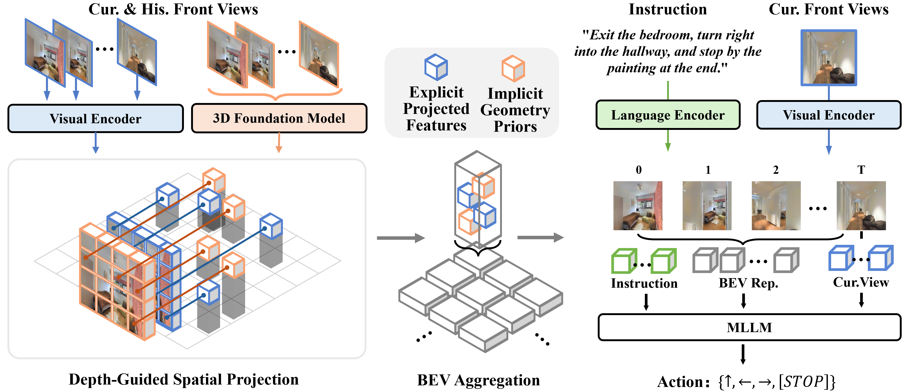

<br>
<p align="center">
<h1 align="center"><strong>GA-VLN: Geometry-Aware BEV Representation for Efficient Vision-Language Navigation</strong></h1>
  <p align="center">
    Jiahao Yang</a>&emsp;
    Zihan Wang</a>&emsp;
    Xiangyang Li</a>&emsp;
    Xing Zhu</a>&emsp;
    Yujun Shen</a>&emsp;
    Yinghao Xu†</a>&emsp;
    Shuqiang Jiang†</a>&emsp;
    <br>
  </p>
</p>

<div id="top" align="center">

[](https://arxiv.org/)
[](https://huggingface.co/)

</div>

<div align="center">
  
</div>

-----

## 🌟 Official implementation of **GA-VLN**, a geometry-aware BEV representation framework designed for Vision-Language Navigation (VLN).
- **Efficient BEV Representation**: Compresses dense multi-view visual observations into a unified BEV space for efficient representation.
- **Robust Spatial Reasoning**: Integrates a 3D foundation model to dramatically enhance geometry-aware perception.
- **Real-World Resilience**: Demonstrates high robustness against sensor noise modeled after real-world robot error profiles.

-----

## ⚙️ Requirements

**1. Create environment**

```bash
conda create -n gavln python=3.9
conda activate gavln
pip install torch==2.1.2 torchvision==0.16.2 --index-url https://download.pytorch.org/whl/cu121 -r requirements.txt
```

**2. Install Habitat**
```bash
conda install habitat-sim==0.2.4 withbullet headless -c conda-forge -c aihabitat
git clone --branch v0.2.4 https://github.com/facebookresearch/habitat-lab.git
cd habitat-lab
pip install -e habitat-lab  # install habitat_lab
pip install -e habitat-baselines # install habitat_baselines
```

-----

## 📦 Data & Checkpoints Preparation

Download the [VLN-CE](https://github.com/jacobkrantz/VLN-CE) data and [SigLIP](https://huggingface.co/google/siglip2-so400m-patch14-384) & [VGGT](https://huggingface.co/facebook/VGGT-1B) backbones. Your directory tree should look like this:
```text
GA-VLN/
├── vln_data/
│   └── scene_datasets/
│   └── datasets/
├── model/
│   ├── siglip-so400m-patch14-384/
│   └── VGGT-1B/
├── checkpoints/
│   └── gavln_official/

